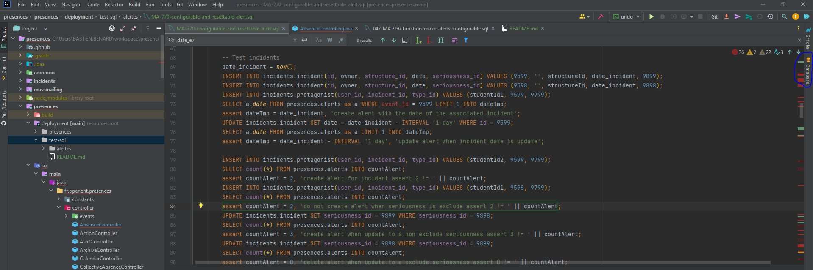
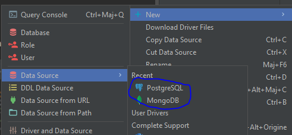
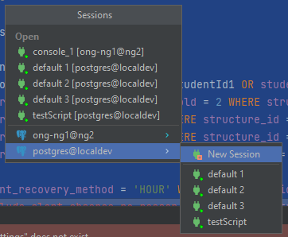

## Faire des scripts de reverse

#### Pourquoi faire des scripts de reverse ?
Lorsque l'on rajoute une fonctionnaliser qui touche aux bases de données il faut prévoir le scénario où votre code ne fait pas exactement ce qu'il faut.
Si vous avez modifié des données, il faut pouvoir les restituer.
Voici par exemple en code et son reverse:
```sql
ALTER TABLE presences.alerts ADD COLUMN event_id bigint NOT NULL; -- ajout d'un champ en base
-- Script de reverse
ALTER TABLE presences.alerts DROP COLUMN event_id; -- suppresion du champ
``` 

## Faire des scripts de test

#### Pourquoi faire des scripts de test ?
Ces scripts de test vous permettent de vous assurer que tout fonctionne comme prévu.
Il est toujours bon de savoir en avance si nos modifications ne vont pas avoir un impact sur le code déjà existant.

## Lancer les tests en local

**Attention**: les tests peuvent avoir besoin de modifier vos tables. Faite un backup, si vous ne voulez perdre aucune donnée.
https://confluence.support-ent.fr/pages/viewpage.action?pageId=67214808

### Configuration base de donnée
Tout d'abord vous devez rajouter la base de données sur Intellij.



Vous pouvez faire un clic droit > New > Database. Choisissez PostGres ou Mongo.



Remplissez les champs pour ajouter la base.

Ensuite ouvrez un fichier de test. Puis faite ctrl+a (Séléctionne tout le script) puis ctrl+enter (Execute le script)
Une nouvelle fenêtre va s'ouvrir. Vous pouvez créé une nouvelle session ou en utiliser une déjà existante.


